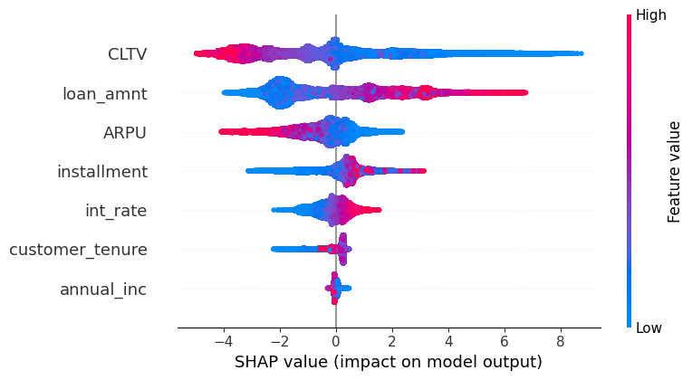
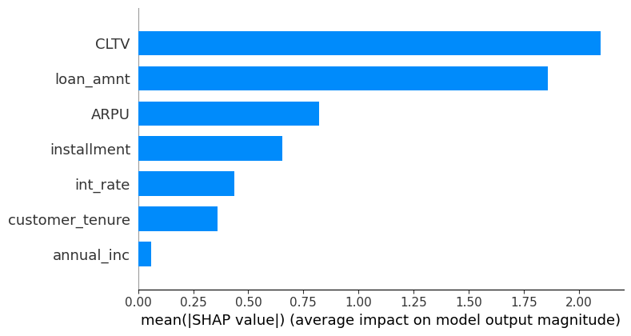

# FinSurf: Credit Risk & Customer Retention Analytics Platform

FinSurf is a full-stack credit risk and customer intelligence platform designed for financial institutions to monitor and predict repayment risk, churn behavior, and segment-level loan dynamics using real-time machine learning and time series forecasting.
---

## key Features

- **Time-Series Forecasting** for:
  - Loan repayment trends using Prophet & SARIMA
  - Customer churn rate evolution
  - Segment-level loan volume projections

- **Segment-Wise Forecasting**:
  - At-Risk Value Drainers
  - Budget Loyalists
  - High-Value Champions
  - Long-Term Sleepers

- **KPI Engineering**:
  - Churn Rate, Repayment Rate
  - CLTV, ARPU, LGD, PD, ECL

- **Interactive BI Dashboard** via Streamlit:
  - Forecast overlays (actual vs predicted)
  - Dynamic segment-level exploration
  - Future prediction breakdowns

---


## Tech Stack

- **Data Cleaning:**	pandas, numpy, seaborn
- **Forecasting:**	fbprophet, SARIMA (statsmodels)
- **ML Modeling:**	scikit-learn, SHAP
- **Dashboarding:**	Streamlit, Power BI 
- **Notebook Dev:**	Jupyter, VS Code
- **Visualization:**	matplotlib, seaborn, plotly
- **Forecast I/O Format:**	.csv with Month, Actual, Forecast, Lower, Upper columns
- **Data:** LendingClub Loan Data
---

## Directory Structure

```plaintext
FinSurf/
├── actuals/
│ ├── actual_churn_rate.csv
│ ├── actual_total_repayment.csv
│ └── actual_segment_.csv (for each segment)
│
├── forecasts/
│ ├── prophet_churn_forecast.csv
│ ├── prophet_total_repayment.csv
│ ├── forecast_segment_.csv (for each segment)
│ ├── sarima_forecast_results.csv
│ └── segment_forecast_summary.csv
│
├── streamlit_app/
│ └── forecast_dashboard.py # Streamlit dashboard
│
├── notebooks/
│ ├── data_exploration.ipynb
│ ├── kpi_calculator.ipynb
│ ├── Modeling_Churn.ipynb
│ ├── customer_segmentation.ipynb
│ ├── forecast_revenue_sariam_prophet.ipynb
│
├── data/ # Shared data access directory
  ├── exports
│ ├── processed
│ ├── raw
├── outputs/ # Exported files/figures
├── reports/ # Project deliverables / writeups
├── scripts/ # Helper functions/scripts
├── requirements.txt # Python dependencies
├── README.md
└── LICENSE

```
---

## Quick Start

```bash
git clone https://github.com/YOUR_USERNAME/FinSurf.git
cd FinSurf
pip install -r requirements.txt

# Launch the Streamlit dashboard
streamlit run streamlit_app/forecast_dashboard.py

```
---
## Phase-by-Phase Execution Summary

### Data Acquisition & Exploration
- **Datasets Used:** [LendingClub Loan Data (Kaggle)](https://www.kaggle.com/datasets/wordsforthewise/lending-club)
  - Segment-specific and aggregated CSVs from the FinSurf pipeline
- **Tasks:**
  - Loaded data using pandas
  - Set display and column type configurations
  - Counted numerical and categorical variables
  - Created column metadata dictionary for profiling
  - Dropped high-missing columns (>50%)
  - Saved cleaned dataset

### KPI Development
**Objective**: Derive key financial metrics  by customer group and cohort.

- **KPIs Computed:**
  - **PD**: Probability of Default
  - **LGD**: Loss Given Default
  - **ECL**: Expected Credit Loss
  - **ARPU**: Average Revenue Per User
  - **CLTV**: Customer Lifetime Value

**Tools & Methods**:
- Pandas, NumPy,PostgreSQL (for queries), groupby/aggregation
- Power BI & Seaborn for visualization
- SQL Views (`vw_loan_kpi_metrics`) for pipeline-ready dashboards

**Output**:
- KPI Trends by cohort
- Customer-level risk and value metrics

## Churn Prediction Model
**Objective**: Predict churn using behavioral and financial patterns.

**Tools & Methods**:
- XGBoost Classifier
- Data Preprocessing, Label Encoding, SMOTE (if imbalance), train-test split
- Evaluation: ROC, AUC, Precision, Recall, F1-score

**Explainability**:
- `shap.Explainer(xgb_clf)` on test data
- Visuals:
  - 
  - 

---
## Customer Segmentation
**Objective**: Segment customers for strategic targeting and retention analysis.

**Tools & Methods**:
- KMeans and DBSCAN clustering
- Silhouette analysis
- Segment overlays in Power BI

**Segments Identified**:
- High-Value Champions
- Budget Loyalists
- At-Risk Value Drainers
- Long-term Sleepers

 ## Clustering Model

- **Algorithm**: KMeans (k=4, selected via silhouette analysis)
- **Input Features**: `CLTV`, `Churn_Probability`, `ARPU`, `Risk_Score_Normalized`
- **Output**: `Segment_Label` assigned to each customer

## Segment KPI Analysis
Visualizations created in **Power BI**:
- Bar plots and donut charts for:
  - Segment count distribution
  - Average CLTV by segment
  - Average ARPU by segment
  - Average Churn Probability by segment
  - Average Risk Score by segment
- Interactive **segment slicer** added to filter all charts
- Segment label integrated into core dataset

---
## Forecasting Modules

### 1. Total Repayment Forecast
- `Prophet` on historical monthly repayment volumes
- Outputs:
  - Trend, weekly seasonality
  - Confidence intervals
  - `prophet_total_repayment.csv`

### 2. Churn Risk Forecast
- `Prophet` on monthly churn rate trend
- Output CSV: `prophet_churn_forecast.csv`

### 3. Segment-Level Loan Volume Forecasts
- Prophet models for each customer segment
- CSVs per segment under `forecasts/`

---

## Forecast Dashboard (Streamlit)
FinSurf includes a visual dashboard that allows business users to explore actual vs forecasted KPIs across the board.

- **Churn Risk Forecast:** Churn rate forecast vs actuals

- **Total Repayment Forecast:** Loan repayment trend overlays

- **Segment-Level Forecasts:** Forecasts for four customer segments

- **Select your view:** Toggle through key performance variables

**Launch Command**:
```bash
cd streamlit_app
streamlit run forecast_dashboard.py
```

      Note: Some modules may fail if column naming conventions mismatch. Ensure your actuals and forecasts use the {metric}_{actual} and {metric}_{forecast} naming convention.

## Power BI Integration

- Predictions imported into Power BI  
- Visualizations:
- Churn Probability Distribution (Histogram)
- Total Predicted Customers (Card)
- Churned vs Retained Count (Bar)
- KPI Cards: Avg ARPU, CLTV by Churn Status

> Dataset used in Power BI: `outputs/xgb_churn_predictions.csv`

### Segment Strategy Matrix

| Segment               | Volume       | CLTV       | Churn Risk | Strategic Action                              |
|-----------------------|--------------|------------|------------|-----------------------------------------------|
| **Budget Loyalists**  |  Very Hig   h|    Low     |   Medium   | Upsell with bundles; reduce acquisition cost  |
| **High-Value Champions**  Medium     |  Very High |      Low   | Retain aggressively; offer loyalty programs   |
| **At-Risk Drainers**  |   Moderate   |    Low     |   Very High| Targeted win-back or churn mitigation offers  |
| **Long-term Sleepers**|    Low       |  Very Low  |    Medium  | Dormant — deprioritize or archive             |

## Strategic Recommendations (Module)
- Spike in repayment post-2015 – analyze cohort behavior
- Long-term sleepers show volatility – monitor closer
- Combine SARIMA + Prophet for improved hybrid models
- Add unsupervised anomaly detection

## Business Impact

The FinSurf platform delivers actionable insights for customer retention and loan optimization:

- Focuses retention efforts on high-CLTV, low-risk customers
- Flags at-risk customers for early intervention
- Identifies low-ROI segments (e.g., sleepers, drainers) to optimize marketing and support spend
- Empowers financial analysts to forecast churn and repayments with confidence intervals
- Integrates segment-aware dashboards in BI tools for executive decision-making


## In Progress / Enhancements
- Power BI dynamic dashboard using forecast outputs
- SHAP force plots per customer ID
- ARIMA/SARIMA hybridization for sensitive segments
- Deployment to Hugging Face Spaces


### Deliverables
- `Segment_Label` added to dataset (`loan_kpi_df`)
- Power BI Dashboard with segment-level KPIs and filters
- PNG visualizations saved under `/plots/segmentation`
- Segment strategy table included in report and README
- Enhanced usability with **segment-aware dashboards**

---


### Star This Project

If you found this project insightful or useful, please consider giving it a ⭐ on GitHub! It helps others discover it and supports the creator.

---

### License

This project is under the MIT License. See `LICENSE` for full text.

---

### Contact
Created by Mahasweta Roy

📧 Email Mahasweta

🔗 Connect on LinkedIn

---


